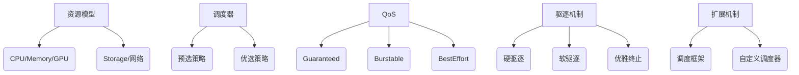

### 第十四章 资源与调度

#### 一、资源模型（核心概念与资源抽象）
1. **资源类型与特性**
   - **可压缩资源**：CPU、网络带宽（可通过调度调整分配）
   - **不可压缩资源**：内存、存储空间（不足时直接导致异常）
   - **扩展资源**：GPU、FPGA等专用设备资源（需通过设备插件上报）

2. **Pod资源规范**
   ```yaml
   resources:
     requests:  # 调度依据（资源预留）
       cpu: "500m"
       memory: "512Mi"
     limits:    # 运行时限制（cgroup约束）
       cpu: "1"
       memory: "1Gi"
   ```
   - **Requests/Limits机制**：调度器基于requests选择节点，运行时通过limits限制资源使用
   - **资源超卖风险**：节点实际资源分配量可能超过物理资源总量（需配合QoS策略）

3. **资源配额管理**
   - **ResourceQuota**：命名空间级资源总量限制
   - **LimitRange**：自动设置Pod默认资源限制
   - **存储资源**：通过StorageClass动态供应PV

#### 二、服务质量与优先级（QoS保障机制）
1. **QoS等级分类**
   | 等级         | 条件                                                                 |
   |--------------|----------------------------------------------------------------------|
   | Guaranteed   | 所有容器设置相同requests/limits（CPU+内存均需满足）                  |
   | Burstable    | 至少一个容器设置requests/limits，但未达到Guaranteed条件              |
   | BestEffort   | 未设置任何资源requests/limits                                       |

2. **资源分配策略**
   - **OOM Killer优先级**：BestEffort > Burstable > Guaranteed
   - **CPU调度权重**：CFS调度器中按requests比例分配时间片
   - **内存回收策略**：kubelet优先回收低QoS等级的Pod内存

3. **优先级与抢占机制**
   ```yaml
   priorityClassName: high-priority
   ```
   - **PriorityClass**：定义优先级数值（0-1亿）
   - **抢占流程**：高优先级Pod触发低优先级Pod驱逐
   - **优雅驱逐**：设置terminationGracePeriodSeconds保证业务连续性

#### 三、驱逐机制（节点资源压力管理）
1. **驱逐触发条件**
   - **内存不足**：节点内存使用量 > eviction-hard阈值
   - **磁盘压力**：节点可用存储 < imagefs.available阈值
   - **PID不足**：进程数超过pid.max设置

2. **驱逐策略配置**
   ```bash
   kubelet --eviction-hard=memory.available<500Mi 
           --eviction-soft=memory.available<1Gi 
           --eviction-soft-grace-period=memory.available=2m
   ```
   - **硬驱逐**：立即终止Pod
   - **软驱逐**：给予宽限期（配合terminationGracePeriodSeconds）
   - **优雅驱逐**：发送SIGTERM信号等待应用优雅关闭

3. **Pod驱逐保护**
   - **PodDisruptionBudget**：定义最小可用实例数
     ```yaml
     minAvailable: 60%  # 保证至少60%的Pod正常运行
     ```
   - **Critical Pod标记**：通过优先级或注解避免被驱逐
     ```yaml
     annotations:
       scheduler.alpha.kubernetes.io/critical-pod: ""
     ```

#### 四、默认调度器（核心调度逻辑）
1. **调度流程**
   ```
   [预选] -> [优选] -> [绑定]
   ```
   - **预选阶段（Predicates）**：
     - NodeAffinity（节点亲和性）
     - PodToleratesNodeTaints（污点容忍）
     - NodeResourcesFit（资源匹配检查）
   - **优选阶段（Priorities）**：
     - LeastRequestedPriority（最小资源使用率）
     - BalancedResourceAllocation（CPU/内存平衡分配）
     - InterPodAffinity（Pod间亲和性）

2. **调度策略扩展**
   - **调度框架（Scheduling Framework）**：
     ```go
     type Plugin interface {
       PreFilter(ctx context.Context, state *CycleState, pod *v1.Pod) 
       Filter(ctx context.Context, state *CycleState, pod *v1.Pod, nodeInfo *NodeInfo)
     }
     ```
   - **自定义调度器**：通过--scheduler-name指定
   - **多调度器共存**：不同调度器处理特定类型的Pod

3. **高级调度特性**
   - **亲和性/反亲和性**：
     ```yaml
     affinity:
       nodeAffinity:
         requiredDuringSchedulingIgnoredDuringExecution:
           nodeSelectorTerms:
           - matchExpressions:
             - key: topology.kubernetes.io/zone
               operator: In
               values: [zoneA]
     ```
   - **污点与容忍**：
     ```yaml
     tolerations:
     - key: "special"
       operator: "Exists"
       effect: "NoSchedule"
     ```
   - **拓扑分布约束**：
     ```yaml
     topologySpreadConstraints:
     - maxSkew: 1
       topologyKey: zone
       whenUnsatisfiable: DoNotSchedule
     ```

#### 五、难点解析与最佳实践
1. **资源模型设计**
   - **黄金法则**：Requests ≈ 日常负载的80%，Limits = Requests × 1.5
   - **监控指标**：结合Prometheus监控实际资源使用率进行调整
   - **HPA联动**：基于资源使用率自动扩缩容

2. **调度性能优化**
   - **调度器吞吐量**：通过--percentageOfNodesToScore参数控制节点筛选比例
   - **批量调度**：使用Scheduler Profile处理批量任务
   - **缓存优化**：启用--enable-taint-manager提升调度决策速度

3. **常见问题排查**
   - **Pending原因分析**：
     ```bash
     kubectl describe pod <pod-name> | grep Events
     ```
   - **资源碎片问题**：通过Descheduler定期重调度
   - **调度器死锁**：检查PodAffinity/AntiAffinity配置冲突

#### 六、知识图谱


#### 七、学习建议
1. **动手实验**：
   - 使用kubectl create deployment创建不同QoS等级的Pod
   - 通过kubectl drain模拟节点维护场景
   - 使用kubectl apply -f部署包含亲和性规则的Deployment

2. **工具推荐**：
   - **kube-scheduler-simulator**：可视化调度过程
   - **kubectl-describe**：查看调度失败详细信息
   - **Prometheus+Grafana**：监控资源使用趋势

3. **延伸阅读**：
   - Kubernetes官方文档《Scheduling Policies》
   - 《Kubernetes in Action》第11章
   - KEPs（Kubernetes Enhancement Proposals）中的调度相关提案

通过以上知识点的系统学习和实践，读者可以深入掌握Kubernetes资源管理与调度的核心机制，为构建高可用、高性能的分布式系统奠定坚实基础。

---

### 多选题

---

**题目1：Kubernetes资源模型的核心设计原则**  
**问题：** 关于Kubernetes资源模型中的“资源请求（Requests）”和“资源限制（Limits）”，以下哪些描述是正确的？  
A. Requests定义了Pod运行所需的最小资源量，调度器基于此分配节点。  
B. Limits是Pod可使用的资源上限，超过可能导致进程被终止。  
C. 仅设置Requests而不设Limits时，Pod可能被分配任意节点。  
D. 若节点总Requests超过节点容量，调度器仍可能继续调度新Pod。  

---

**题目2：服务质量（QoS）与优先级**  
**问题：** 在Kubernetes中，哪些条件会导致Pod被归类为“Guaranteed” QoS等级？  
A. CPU和内存的Requests等于Limits。  
B. 仅设置了CPU的Limits，未设置内存的Requests。  
C. 所有容器的所有资源（CPU、内存）均设置了Limits且无Requests。  
D. 只设置了内存的Requests和Limits，未设置CPU相关值。  

---

**题目3：驱逐机制的条件与策略**  
**问题：** 关于Kubernetes的驱逐机制，以下哪些描述正确？  
A. 当节点内存压力达到硬驱逐阈值时，kubelet会立即终止Pod。  
B. 软驱逐允许配置宽限期，Pod在宽限期内可尝试释放资源。  
C. BestEffort QoS的Pod在资源不足时优先被驱逐。  
D. 驱逐策略仅基于Pod的资源使用量，与QoS无关。  

---

**题目4：默认调度器的工作原理**  
**问题：** Kubernetes默认调度器的调度流程包括哪些阶段？  
A. 预选（Predicates）：过滤不满足条件的节点。  
B. 优选（Priorities）：为节点打分排序。  
C. 抢占（Preemption）：强制驱逐低优先级Pod以调度高优先级Pod。  
D. 绑定（Binding）：将Pod与节点关联，更新etcd。  

---

**题目5：资源配额与限制范围**  
**问题：** 以下哪些属于Kubernetes资源配额（ResourceQuota）的作用？  
A. 限制Namespace中所有Pod的CPU总Requests。  
B. 限制单个Pod的内存Limits不超过指定值。  
C. 限制Namespace中创建的Service数量。  
D. 限制节点上运行的Pod总数。  

---

**题目6：节点亲和性与反亲和性**  
**问题：** 关于节点亲和性（Node Affinity），哪些说法正确？  
A. `requiredDuringSchedulingIgnoredDuringExecution`表示调度时必须满足条件。  
B. 反亲和性用于避免Pod部署到同一节点。  
C. 亲和性规则仅支持基于节点标签的匹配。  
D. 节点亲和性优先级高于Pod资源Requests。  

---

**题目7：Pod优先级与抢占机制**  
**问题：** 高优先级Pod触发抢占机制时，可能发生哪些情况？  
A. 低优先级Pod被立即终止，无宽限期。  
B. 调度器会优先选择对系统影响最小的节点进行抢占。  
C. 抢占仅发生在调度阶段，运行中的Pod不会被抢占。  
D. 抢占可能导致多个低优先级Pod被逐出以腾出资源。  

---

**题目8：资源分配策略的优化**  
**问题：** 哪些方法可优化Kubernetes集群的资源利用率？  
A. 为所有Pod设置相同的Requests和Limits。  
B. 使用Horizontal Pod Autoscaler（HPA）自动调整副本数。  
C. 启用集群自动扩缩容（Cluster Autoscaler）动态增减节点。  
D. 将Burstable QoS的Pod集中在少数节点上运行。  

---

**题目9：临时存储（Ephemeral Storage）管理**  
**问题：** 关于临时存储的驱逐策略，哪些描述正确？  
A. 临时存储的Requests和Limits仅针对容器日志和EmptyDir卷。  
B. 当节点临时存储不足时，kubelet优先驱逐占用最多的Pod。  
C. 临时存储的Limits包括容器镜像占用的空间。  
D. 若Pod未设置临时存储Limits，则其使用量不受限制。  

---

**题目10：调度器扩展与自定义调度**  
**问题：** 如何扩展Kubernetes默认调度器的功能？  
A. 编写自定义调度器并替代默认调度器。  
B. 通过调度框架（Scheduling Framework）插件扩展预选和优选逻辑。  
C. 修改kube-scheduler的源码并重新编译。  
D. 使用节点标签和注解实现自定义调度策略。  

---

### **答案与详解**  

**题目1答案：AB**  
- **A正确**：Requests是调度依据，确保节点有足够资源。  
- **B正确**：Limits是硬限制，超限触发OOM Kill或CPU限流。  
- **C错误**：未设Limits时Pod资源可能被限制为节点容量，但调度仍需满足Requests。  
- **D错误**：调度器不会分配总Requests超过节点可用资源的Pod。  

**题目2答案：AD**  
- **A正确**：Guaranteed需所有容器的CPU/内存Requests=Limits。  
- **D正确**：仅设置内存的Requests=Limits时，CPU未设置则默认为Guaranteed。  
- **B错误**：必须同时设置Requests和Limits。  
- **C错误**：未设置Requests时，K8s会自动将Limits作为Requests，但需显式声明。  

**题目3答案：ABC**  
- **A正确**：硬驱逐立即终止Pod。  
- **B正确**：软驱逐允许宽限期。  
- **C正确**：BestEffort优先级最低。  
- **D错误**：QoS是驱逐的重要依据。  

**题目4答案：ABD**  
- **C错误**：抢占是调度器逻辑的一部分，但非默认流程的显式阶段。  

**题目5答案：AC**  
- **A正确**：ResourceQuota可限制Namespace的CPU总Requests。  
- **C正确**：ResourceQuota可限制Service等对象数量。  
- **B错误**：LimitRange负责限制单个Pod的资源。  
- **D错误**：节点Pod数由节点资源决定，非ResourceQuota范畴。  

**题目6答案：AB**  
- **C错误**：支持节点标签、区域等多种条件。  
- **D错误**：资源Requests是调度前提，优先级更高。  

**题目7答案：BD**  
- **B正确**：调度器选择驱逐代价最小的节点。  
- **D正确**：可能驱逐多个Pod以满足资源需求。  
- **A错误**：低优先级Pod有终止宽限期。  
- **C错误**：运行中的Pod可能被抢占。  

**题目8答案：BC**  
- **B正确**：HPA根据负载自动扩缩副本。  
- **C正确**：Cluster Autoscaler动态调整节点数。  
- **A错误**：统一设置会导致资源浪费或不足。  
- **D错误**：集中Pod可能加剧资源竞争。  

**题目9答案：BC**  
- **B正确**：按占用排序驱逐。  
- **C正确**：临时存储包括镜像、日志和EmptyDir。  
- **A错误**：临时存储还包括镜像层。  
- **D错误**：未设Limits时Pod可能被限制为节点容量。  

**题目10答案：ABC**  
- **A正确**：可完全替换默认调度器。  
- **B正确**：调度框架支持插件扩展。  
- **C正确**：修改源码是可行但复杂的方式。  
- **D错误**：标签和注解是策略实现方式，非扩展调度器功能的方法。