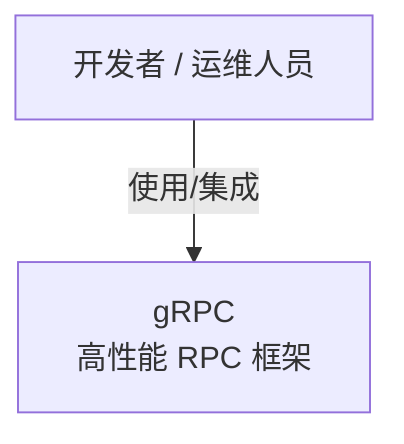
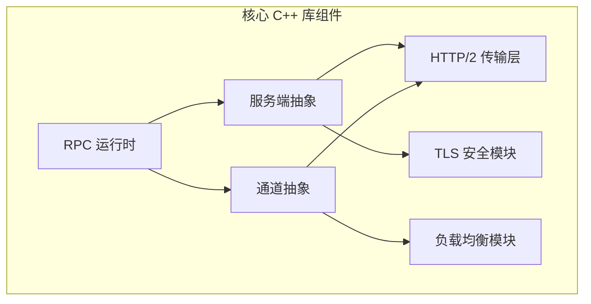
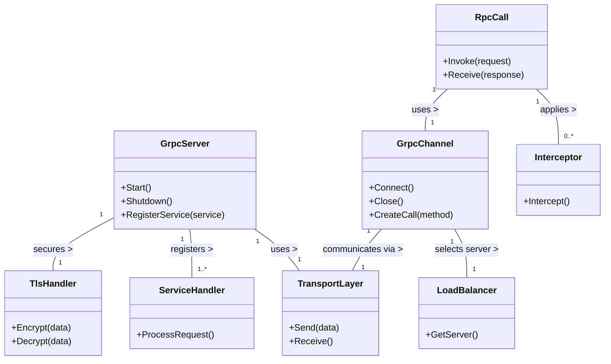

下面给出一个基于 C4 模型的分层视图，使用 Mermaid 语法描述了 gRPC 项目的整体架构。这里包含三个层级的图示：

1. **系统上下文图（System Context Diagram）**  
   描述了 gRPC 作为一个系统，与外部角色（如开发者、运维人员等）之间的交互关系。

2. **容器图（Container Diagram）**  
   描述了 gRPC 系统内部的主要容器（例如核心库、语言绑定、构建/测试系统、文档示例、CLI 工具等）以及它们之间的关系。

3. **组件图（Component Diagram for Core Library）**  
   针对核心 C++ 库内部的主要组件进行说明，包括 RPC 运行时、通道、服务端抽象、传输、加密安全及负载均衡模块。

你可以将下面各部分代码分别粘贴到支持 Mermaid 的编辑器中进行预览。

---

### 1. 系统上下文图



---

### 2. 容器图

```mermaid
flowchart TD
    Developer[开发者 / 运维人员]

    subgraph GRPC[ gRPC 系统 ]
        CORE[核心 C\+\+ 库\n(RPC 运行时、通道、服务端等)]
        BINDINGS[语言绑定\n(C\+\+, Java, Python, 等)]
        BUILD[构建 & CI 基础设施\n(Bazel、Make、自动测试)]
        DOCS[文档与示例\n(教程、示例代码)]
        TOOLS[CLI 工具 & 辅助工具]
    end

    Developer -->|使用语言绑定集成服务| BINDINGS
    Developer -->|查阅使用指南| DOCS
    BINDINGS -->|封装调用| CORE
    BUILD -->|构建与测试| CORE
    BUILD -->|构建与测试| BINDINGS
    TOOLS -->|辅助管理与调试| CORE


```

---

### 3. 组件图（核心 C++ 库内部）



### 4. 代码层面类图



---

#### 说明

- **GrpcServer**  
  负责启动服务、注册服务接口（ServiceHandler）以及管理连接。它通过 **TransportLayer** 进行数据传输，并依赖 **TlsHandler** 实现安全通信。

- **GrpcChannel**  
  封装了客户端到服务端的通信逻辑，负责建立连接（Connect）、关闭连接（Close）以及创建远程调用（CreateCall）。它同样依赖 **TransportLayer** 传输数据，并利用 **LoadBalancer** 选择合适的服务端。

- **RpcCall**  
  代表一次具体的远程调用（RPC），内部通过 **GrpcChannel** 来传递调用请求与响应，并可以在调用前后使用 **Interceptor** 对请求进行拦截或处理。

- **TransportLayer**  
  作为底层通信层，负责数据帧的发送与接收，连接服务端和客户端之间的消息传递。

- **TlsHandler**  
  提供加密与解密功能，保障数据在传输过程中的安全性。

- **LoadBalancer**  
  在多服务实例部署场景中，通过负载均衡算法选择合适的服务端处理请求。

- **ServiceHandler**  
  实现具体业务逻辑，处理客户端发起的 RPC 请求。

- **Interceptor**  
  用于扩展 RPC 调用前后的处理逻辑，如日志记录、监控统计或其他中间件逻辑。

这种代码层面的类图有助于理解 gRPC 内部的实现细节，展示了各个核心组件和类之间如何协同工作，从而实现高性能和安全的 RPC 通信。

---

### 说明

- **系统上下文图**中，开发者/运维人员作为主要使用者，与整个 gRPC 系统交互。
- **容器图**展示了 gRPC 的内部构成，每个容器负责不同的职责：  
  - **核心 C++ 库** 提供了基础 RPC 功能；  
  - **语言绑定** 将核心功能暴露给各语言；  
  - **构建 & CI 基础设施** 确保代码的构建、测试和质量；  
  - **文档与示例** 帮助用户理解和使用 gRPC；  
  - **CLI 工具** 则为调试和日常运维提供支持。
- **组件图**进一步细化了核心 C++ 库内部的结构，展示了各个组件如何协同工作，保证高性能与安全通信。

这三个图示从不同层面详细描述了 gRPC 项目的架构，符合 C4 模型的分层描述要求。