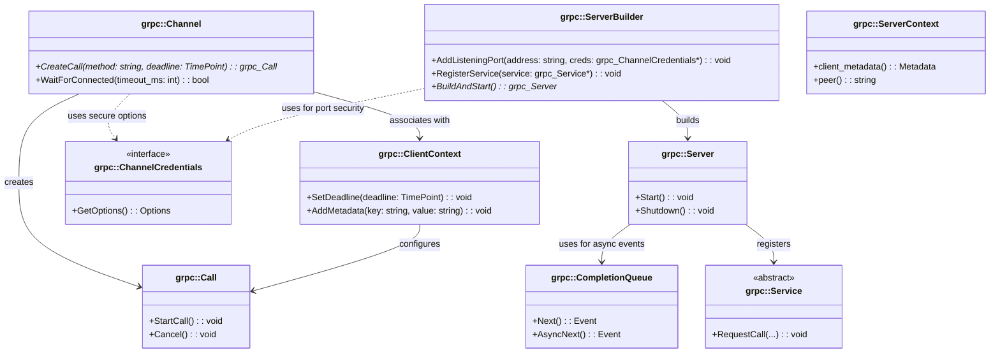

### 说明

1. **别名定义**使用形式 `class internalID["显示标签"] { ... }` 定义类，其中内部 ID 如 `grpc_Channel` 不含特殊字符，显示标签则为 `"grpc::Channel"`。这种写法可以避免 Mermaid 对特殊字符（如双冒号）的解析错误。
2. **客户端组件**

   - **grpc::Channel**：用于创建 RPC 调用（grpc::Call）并管理与服务器的连接。
   - **grpc::ClientContext**：保存单次 RPC 调用的上下文信息，如截止时间和元数据；与 RPC 调用对象配合使用。
   - **grpc::Call**：表示一次具体的 RPC 调用，支持启动（StartCall）和取消（Cancel）操作。
   - **grpc::CompletionQueue**：处理异步事件，客户端与服务端均会使用。
   - **grpc::ChannelCredentials**：接口类，用于定义安全连接所需的证书和凭据。
3. **服务端组件**

   - **grpc::Server**：服务端的核心类，用于启动、监听并处理 RPC 请求。
   - **grpc::ServerBuilder**：用于构建和启动服务端，注册服务及监听端口，同时依赖安全凭据。
   - **grpc::ServerContext**：为服务端单次 RPC 调用提供上下文信息，如客户端元数据、远程地址等。
   - **grpc::Service**：抽象类，所有具体服务应继承自此接口，实现具体的请求处理逻辑。
4. **关系说明**

   - **构建关系**：ServerBuilder 构建、启动 Server；Server 内部使用 CompletionQueue 处理异步事件，并注册 Service。
   - **依赖/协作关系**：Channel 与 ClientContext 和 Call 协作完成一次 RPC 调用；ClientContext 为 Call 配置调用上下文；同时，Channel 和 ServerBuilder 均依赖 ChannelCredentials 来支持安全连接和监听端口的安全保护。

这种详细的类图可以直观反映出 gRPC 核心组件之间的面向对象关系，帮助理解该项目在客户端和服务端方面的整体架构。
