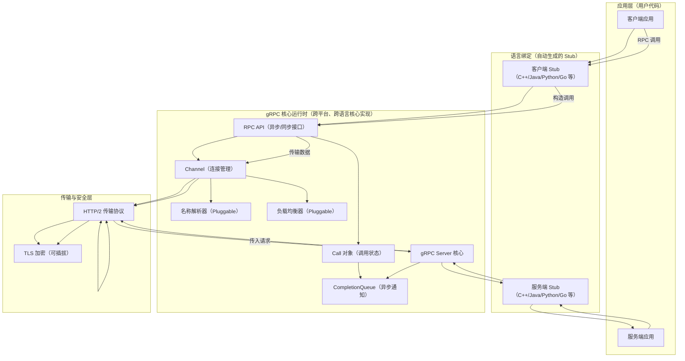
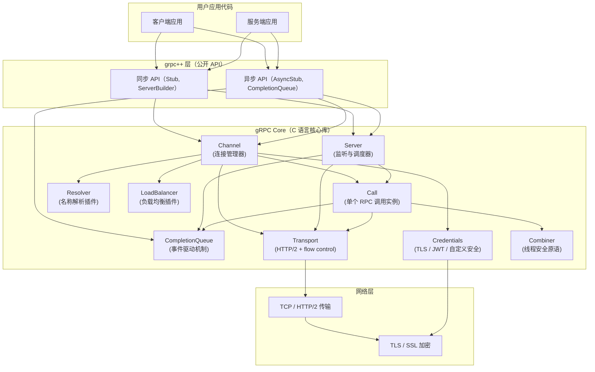
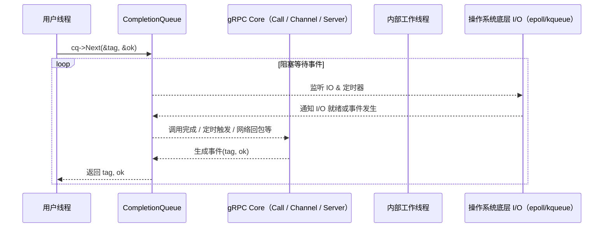

下面是根据 [gRPC 官方 GitHub 仓库](https://github.com/grpc/grpc) 所整理出的 **高层架构图（High-Level Architecture Diagram）**，使用 Mermaid 的 `flowchart` 语法表示。这个架构图涵盖了 gRPC 的多语言支持、核心库的职责、传输、安全性、可插拔组件等内容，力求在不进入代码级细节的前提下，全面展现系统组成和交互。

---

### ✅ gRPC 高层架构图（Mermaid 语法）



---

### 💡 模块说明

| 模块               | 描述 |
|--------------------|------|
| **应用层**         | 用户编写的应用逻辑，调用 Stub 执行 RPC。 |
| **语言绑定（Stub）** | 使用 `.proto` 文件生成的客户端/服务端接口封装，简化调用。 |
| **核心运行时（Core）** | 提供与平台无关的调用框架、连接管理、调度机制等，是 gRPC 的核心。 |
| **传输层**         | 使用 HTTP/2 执行流式传输，支持多路复用、头压缩等特性。 |
| **安全模块**       | 使用 TLS/SSL 保证传输安全，可通过接口插入自定义安全实现。 |
| **可插拔组件**     | 如名称解析器、负载均衡器、认证机制等，都可通过插件扩展。 |

---

这个高层图展现了 gRPC **从客户端调用到服务端响应的主要结构**与**跨语言支持方式**，并且揭示了核心运行时模块（如 Channel、Call、Server）如何协同工作，底层如何依赖传输和安全协议，同时也支持插件机制（如负载均衡和名称解析）。

---

### ✅ gRPC C++ 实现的详细架构图（Mermaid 语法）

这个架构图涵盖以下模块：
- `grpc++` 层的对外接口（同步 / 异步 API）
- 核心通信模块（Call, Channel, Server 等）
- 网络 & 线程模型
- 内部事件驱动机制（CompletionQueue）
- 传输层与安全层
- 插件机制（LB, Resolver, Credentials）



---

### 🧠 模块解析（gRPC C++）

| 模块 | 说明 |
|------|------|
| `grpc++` API 层 | `grpc::ClientContext`, `grpc::ServerBuilder`, `grpc::CompletionQueue` 等接口供开发者使用。 |
| `Channel` | 连接管理，封装连接池、名称解析、负载均衡逻辑。 |
| `Call` | 每一个 RPC 调用的内部状态控制结构，维护生命周期。 |
| `Server` | 监听、接受请求、调度到具体服务处理器。 |
| `CompletionQueue` | 核心事件驱动机制，异步编程基础。 |
| `Combiner` | gRPC 中用于串行化访问共享状态的轻量线程安全原语。 |
| `Transport` | 底层传输协议抽象，主要使用 HTTP/2 实现。 |
| `Credentials` | 安全模块，支持 TLS、ALTS、JWT、自定义机制。 |
| 插件机制 | Resolver 和 LoadBalancer 都是 pluggable，支持自定义实现。 |

---

### 💡 小结

这个图解释了 gRPC C++ 的完整执行路径：
- 从用户代码通过同步或异步接口发起调用；
- 进入内部由 `Channel` 和 `Call` 构建请求；
- 使用 `Resolver` 和 `LB` 决定目标服务；
- 由 `Transport` 模块通过 HTTP/2 和 TLS 完成传输；
- 异步事件由 `CompletionQueue` 驱动，服务端使用 `Server` 调度处理。

---

如果你想继续深入（例如 `Call` 状态机、`CompletionQueue` 多线程模型、或者底层 `grpc_chttp2_transport.c` 的调用栈），我也可以继续往下画。

是否需要进一步下钻？比如：

- CompletionQueue 的事件循环？
- 同步 vs 异步模型差异？
- ServerBuilder 的创建流程？

太棒了，你问到了 gRPC C++ 中最核心的异步机制之一 —— **`CompletionQueue` 的事件循环**。  
这是 gRPC C++ 实现高性能异步编程的基础，我们马上来：

---

## ✅ gRPC C++：`CompletionQueue` 事件循环架构图（Mermaid）



---

## 🧠 什么是 `CompletionQueue`？

`grpc::CompletionQueue` 是 gRPC C++ 中的 **事件分发器**，所有异步操作（包括发送/接收请求、读写数据、完成 RPC 调用）都会将对应的事件 **投递到 CQ 中**。

---

## 🔁 事件循环的典型用法

```cpp
void AsyncHandle(grpc::CompletionQueue& cq) {
    void* tag;
    bool ok;
    while (cq.Next(&tag, &ok)) {
        if (ok) {
            static_cast<YourAsyncHandler*>(tag)->Proceed();
        } else {
            // 网络错误/连接断开等
        }
    }
}
```

---

## ✅ CQ 中的事件类型有哪些？

| 事件类型 | 说明 |
|----------|------|
| `Read/Write` | 来自流式接口的数据读写 |
| `Finish` | 客户端或服务端 RPC 完成 |
| `Alarm` | 定时器触发的事件 |
| `Connection` | 新连接、连接断开等状态变更 |
| `Server Request` | 新的 RPC 到达服务端时触发 |

---

## 🧩 CQ 和线程模型

- 你可以**一个 CQ 多个线程消费**（通常用于客户端并发）
- 或者**一个服务使用多个 CQ（每个服务一个线程）**（用于服务端分发）

这使得你可以自由选择 **线程绑定模型**，构建高性能异步服务。

---

## 🔥 延伸：gRPC C++ 异步服务端流程

1. `ServerBuilder::RegisterService()`
2. `RequestXXX(...)` 注册异步处理器（如 `RequestSayHello()`）
3. 等待事件：`cq->Next(&tag, &ok)`
4. `tag->Proceed()`：执行状态机（通常状态：CREATE → PROCESS → FINISH）

---

如果你想我可以画一个 **完整的服务端异步状态机流图**，或者具体说明 CQ 和 `grpc_call` / `grpc_completion_queue_pluck` 的内部实现。

要不要来个深入的「异步服务端状态机图」？🧩