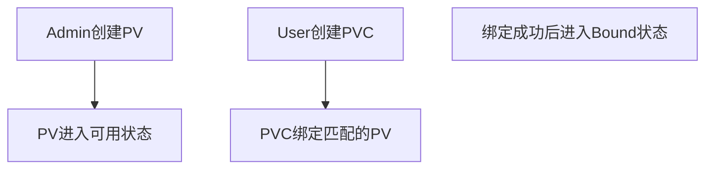
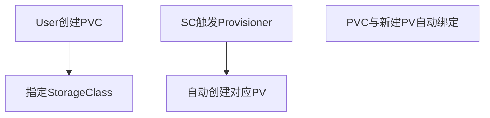
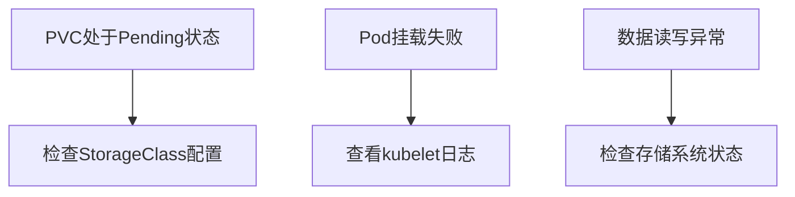

### 第十三章 持久化存储

#### 一、Kubernetes存储设计核心概念
（1）存储抽象模型
- **PersistentVolume (PV)**：集群级别的存储资源抽象（如NFS卷/云存储盘）
- **PersistentVolumeClaim (PVC)**：用户对存储资源的声明请求（容量/访问模式）
- **StorageClass (SC)**：动态存储供给策略（自动创建PV的模板）

（2）核心设计思想
- 解耦存储供应方与消费方
- 支持静态分配（手动创建PV）与动态分配（按需自动创建PV）
- 提供标准化的存储接口（CSI）

#### 二、存储分配机制解析
（1）静态分配流程

（2）动态分配流程

（3）关键差异对比
| 特征         | 静态分配               | 动态分配               |
|--------------|------------------------|------------------------|
| 资源创建方式 | 管理员手动预置         | 按需自动创建           |
| 适用场景     | 固定存储资源配置       | 弹性伸缩的云环境       |
| 管理成本     | 高（需容量规划）       | 低（自动化）           |

#### 三、容器存储接口(CSI)架构解析
（1）传统In-Tree模式痛点
- 存储驱动与Kubernetes核心代码强耦合
- 新增存储系统需修改K8s代码库
- 版本迭代受限于K8s发布周期

（2）CSI架构创新
- **标准化接口**：定义gRPC接口规范（CreateVolume/AttachVolume等）
- **组件分离**：
  - Driver Registrar：注册存储驱动
  - External Provisioner：处理存储供给
  - External Attacher：处理存储挂载
- **插件化机制**：通过Sidecar容器实现热插拔

（3）核心优势
- 解耦K8s核心代码与存储实现
- 支持第三方厂商自定义开发
- 无需重启集群即可升级存储驱动

#### 四、存储技术生态全景
（1）主流存储类型支持
- **块存储**：AWSEBS/GCEPD/CephRBD
- **文件存储**：NFS/GlusterFS/AzureFile
- **对象存储**：S3/MinIO/CephObject

（2）云原生存储方案
- **Rook**：基于Ceph的K8s原生存储方案
- **Longhorn**：轻量级分布式块存储
- **OpenEBS**：容器原生存储方案

（3）数据持久化关键策略
- **存储拓扑感知**：保证Pod与存储的地理位置亲和性
- **多副本机制**：通过存储系统实现数据冗余
- **备份恢复**：Velero等工具实现定时快照

#### 五、重点难点解析
（1）PV访问模式深度理解
- **RWO**(ReadWriteOnce)：单节点读写
- **ROX**(ReadOnlyMany)：多节点只读
- **RWX**(ReadWriteMany)：多节点读写

（2）存储生命周期管理
- **Reclaim Policy**：
  - Retain（保留数据）
  - Delete（自动删除）
  - Recycle（废弃模式）

（3）跨可用区存储挑战
- 区域亲和性调度（VolumeZonePredicate）
- 分布式存储系统的区域复制能力
- 应用级别的数据同步机制

#### 六、最佳实践建议
1. **生产环境存储选择**
- 优先选择云厂商托管存储服务
- 自建集群推荐Ceph/Rook方案
- 关键业务数据配置跨AZ复制

2. **性能优化方向**
- 使用本地SSD存储加速IO
- 调整文件系统参数（ext4/xfs）
- 监控IOPS/吞吐量指标

3. **故障排查路径**

本章通过Kubernetes存储模型的设计演进，揭示了云原生时代持久化存储的核心解决方案。掌握PV/PVC的动态供给机制、理解CSI的解耦设计思想、熟悉主流存储方案的特性和适用场景，是构建可靠分布式存储系统的关键所在。需要特别关注存储与计算资源的协同调度策略，以及多可用区场景下的数据一致性保障方案。

---
### 多选题
---
题目一：Kubernetes持久化存储设计原则
**问题：以下哪些是Kubernetes持久化存储的核心设计目标？**
A. 实现容器存储生命周期与Pod解耦  
B. 支持跨节点数据持久化  
C. 提供统一的存储抽象接口  
D. 强制使用动态存储分配策略  
E. 限制存储只能由集群管理员管理  

---

题目二：存储卷类型特性
**问题：关于Kubernetes存储卷的哪些描述是正确的？**
A. emptyDir卷的生命周期与Pod绑定  
B. hostPath卷支持跨节点数据持久化  
C. NFS卷需要依赖外部存储系统  
D. configMap卷只能用于配置文件读写  
E. PersistentVolumeClaim是存储资源请求的抽象  

---

题目三：静态存储分配流程
**问题：静态存储分配的正确工作流程包含哪些步骤？**
A. 管理员预创建PersistentVolume  
B. 用户提交PersistentVolumeClaim  
C. StorageClass自动生成存储配置  
D. 系统自动执行PV与PVC绑定  
E. 必须手动指定PV和PVC的匹配关系  

---

题目四：动态存储分配机制
**问题：关于动态存储分配的正确描述是？**
A. 依赖StorageClass定义供应策略  
B. PVC创建会触发PV自动生成  
C. 需要预先创建物理存储设备  
D. 仅支持云平台提供的存储服务  
E. 支持按需扩展存储容量  

---

题目五：FlexVolume与CSI对比
**问题：以下哪些是CSI相比FlexVolume的优势？**
A. 支持容器标准化存储接口  
B. 解耦存储驱动与Kubernetes核心代码  
C. 强制使用特定编程语言开发插件  
D. 提供更细粒度的存储操作API  
E. 必须通过DaemonSet部署驱动程序  

---

题目六：In-Tree插件问题
**问题：In-Tree存储插件的局限性包括？**
A. 与Kubernetes版本强耦合  
B. 无法支持第三方存储系统  
C. 部署需要重新编译kubelet  
D. 难以实现存储功能快速迭代  
E. 缺乏权限隔离机制  

---

题目七：持久化存储最佳实践
**问题：构建可靠持久化存储的建议包括？**
A. 优先使用动态存储分配  
B. 为不同业务设置StorageClass  
C. 所有Pod直接绑定PV  
D. 定期执行存储卷快照  
E. 强制使用ReadWriteOnce访问模式  

---

题目八：CSI架构组件
**问题：CSI架构的核心组件包含？**
A. Controller Plugin  
B. Node Plugin  
C. Volume Snapshotter  
D. StorageClass Controller  
E. API Server Extension  

---

题目九：存储扩展模式
**问题：Out-of-Tree存储插件的实现方式包括？**
A. 通过CRD自定义存储资源  
B. 使用FlexVolume驱动程序  
C. 集成CSI兼容插件  
D. 修改kubelet源代码  
E. 依赖Kubernetes内置存储类  

---

题目十：持久化存储风险
**问题：使用持久化存储时需要注意哪些风险？**
A. 存储性能受网络延迟影响  
B. 多节点同时写入导致数据冲突  
C. 存储配额耗尽引发系统故障  
D. PV与PVC生命周期强绑定  
E. 容器重启导致存储数据丢失  

---

### 答案与解析

题目一答案：ABC
**解析**：  
A. 正确，PV生命周期独立于Pod实现解耦  
B. 正确，持久化存储的核心目标  
C. 正确，通过PV/PVC提供统一接口  
D. 错误，支持静态/动态多种分配策略  
E. 错误，用户可通过PVC自主申请存储  

---

题目二答案：ACE
**解析**：  
A. 正确，emptyDir随Pod销毁  
B. 错误，hostPath无法跨节点  
C. 正确，NFS属于外部存储  
D. 错误，configMap也可用于环境变量  
E. 正确，PVC是存储请求抽象  

---

题目三答案：ABD
**解析**：  
A. 正确，管理员预创建PV  
B. 正确，用户提交PVC请求  
C. 错误，静态分配不使用StorageClass  
D. 正确，系统自动绑定匹配PV/PVC  
E. 错误，可通过storageClassName自动匹配  

---

题目四答案：ABE
**解析**：  
A. 正确，StorageClass定义供应规则  
B. 正确，动态分配核心机制  
C. 错误，物理设备由存储系统管理  
D. 错误，支持多种存储后端  
E. 正确，支持存储卷扩展功能  

---

题目五答案：ABD
**解析**：  
A. 正确，CSI是行业标准  
B. 正确，独立于K8s核心代码  
C. 错误，CSI支持多语言实现  
D. 正确，提供更丰富的操作接口  
E. 错误，CSI通过Sidecar容器部署  

---

题目六答案：ACD
**解析**：  
A. 正确，插件与K8s版本绑定  
B. 错误，可支持第三方存储  
C. 正确，需重新编译核心组件  
D. 正确，功能更新依赖K8s版本  
E. 错误，权限机制与插件无关  

---

题目七答案：ABD
**解析**：  
A. 正确，提高资源利用率  
B. 正确，按业务区分存储策略  
C. 错误，应通过PVC解耦  
D. 正确，保障数据可恢复性  
E. 错误，应根据场景选择访问模式  

---

题目八答案：AB
**解析**：  
A. 正确，处理存储供应逻辑  
B. 正确，负责节点级存储操作  
C. 错误，属于扩展功能组件  
D. 错误，属于K8s核心组件  
E. 错误，通过CRD实现扩展  

---

题目九答案：ABC
**解析**：  
A. 正确，通过CRD自定义资源  
B. 正确，FlexVolume是标准接口  
C. 正确，CSI是主流实现方式  
D. 错误，违背Out-of-Tree原则  
E. 错误，与插件实现无关  

---

题目十答案：ABC
**解析**：  
A. 正确，网络存储存在延迟问题  
B. 正确，共享存储需考虑并发控制  
C. 正确，存储配额管理关键  
D. 错误，PV可独立于PVC存在  
E. 错误，持久化存储数据不丢失