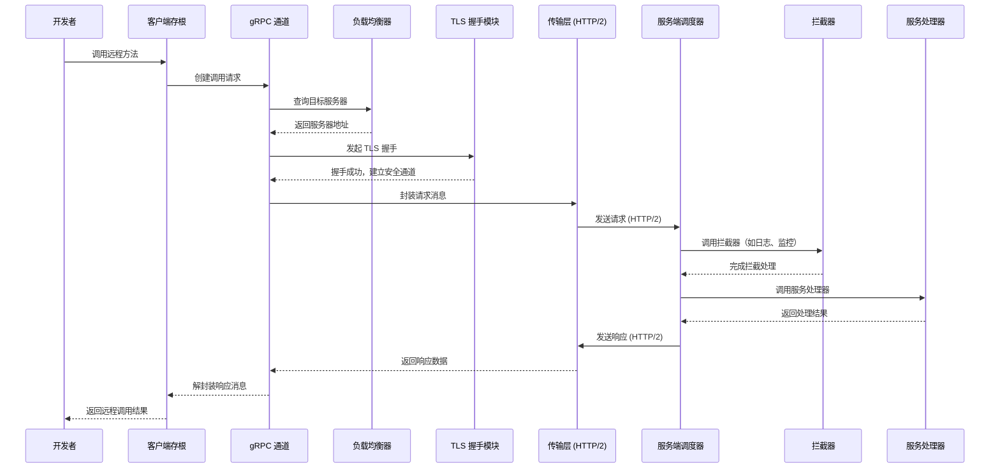

下面提供一个详细的 gRPC 序列图示例，描述了客户端调用远程服务的完整交互流程。该图展示了从客户端发起调用，到 gRPC 通道、负载均衡、传输层（包含 TLS 握手）以及服务端处理（包括拦截器和服务处理器）的完整过程。你可以将下面的代码粘贴到支持 Mermaid 的编辑器中进行预览：

### 说明

- **开发者**：发起远程调用请求。
- **客户端存根 (ClientStub)**：客户端 API 封装，负责将调用请求传递给 gRPC 通道。
- **gRPC 通道 (Channel)**：管理客户端与服务端之间的连接，负责调用创建、连接管理以及消息的封装与解封装。
- **负载均衡器 (LB)**：在多实例部署环境下选择合适的服务器地址。
- **TLS 握手模块 (TLS)**：确保通信建立前完成 TLS 握手，保证数据传输的安全性。
- **传输层 (HTTP/2)**：负责底层消息传输，将请求和响应在客户端与服务端之间传递。
- **服务端调度器 (ServerDispatcher)**：接收请求，并调用后续处理逻辑。
- **拦截器 (Interceptor)**：可选模块，用于实现日志、监控、认证等中间件功能，对请求进行预处理或后处理。
- **服务处理器 (Service)**：实际执行业务逻辑，处理请求并生成响应。

这种序列图能够较详细地展示 gRPC 从客户端发起调用，到服务端处理返回结果的整个流程，便于理解内部工作机制。