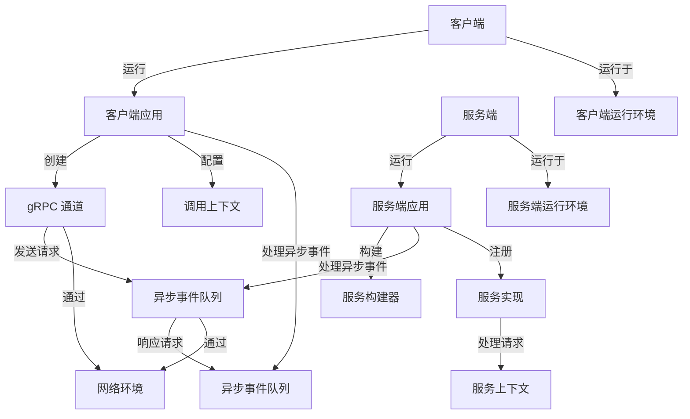

下面是一个基于 gRPC 项目核心架构的详细部署图。该图展示了 gRPC 在客户端与服务端之间的部署关系，以及其依赖的核心组件和运行环境。

### 说明

1. **客户端部分**：
   - **Client**：表示客户端设备或实例。
   - **ClientApp**：客户端应用程序，负责创建 gRPC 通道（ClientChannel）、配置调用上下文（ClientContext），并处理异步事件队列（ClientQueue）。
   - **ClientChannel**：用于与服务端通信的 gRPC 通道。
   - **ClientContext**：存储单次 RPC 调用的上下文信息。
   - **ClientQueue**：处理异步事件，例如请求发送和响应接收。

2. **服务端部分**：
   - **Server**：表示服务端设备或实例。
   - **ServerApp**：服务端应用程序，负责构建服务（ServerBuilder）、注册服务实现（ServerService），并处理异步事件队列（ServerQueue）。
   - **ServerBuilder**：用于构建服务端并注册服务。
   - **ServerQueue**：处理异步事件，例如接收请求和发送响应。
   - **ServerService**：具体的服务实现，负责处理客户端请求。
   - **ServerContext**：提供每次 RPC 请求的上下文信息。

3. **通信关系**：
   - **ClientChannel** 与 **ServerQueue** 之间通过网络环境（EnvNetwork）进行通信，发送请求和接收响应。

4. **运行环境**：
   - **EnvClient**：客户端运行环境，例如本地设备或容器。
   - **EnvServer**：服务端运行环境，例如云服务器或虚拟机。
   - **EnvNetwork**：网络环境，例如 HTTP/2 协议支持的通信网络。

该部署图展示了 gRPC 项目在客户端与服务端之间的核心组件及其运行环境，帮助理解其部署架构和通信流程。你可以根据具体需求进一步扩展或调整此图。